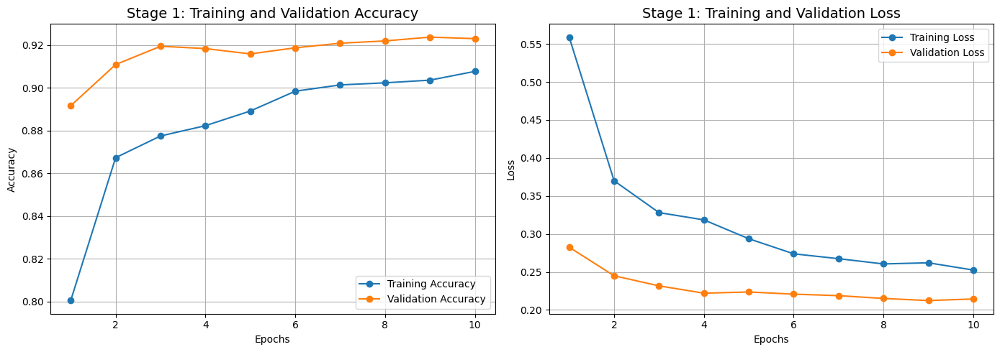
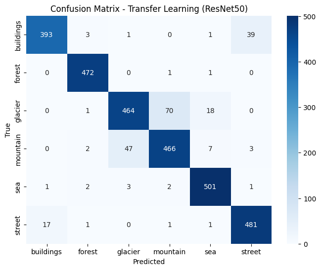

# Technical Report: Intelligent Scene Analysis System

**Author:** Gaurav Verma
**Date:** 2025-08-29

## 1. Project Overview

This report details the development and deployment of the Intelligent Scene Analysis System, as per the assignment brief. The objective was to build a comprehensive service capable of performing three core tasks:
1.  **Classifying** natural scene images into one of six categories[cite: 5].
2.  **Generating** a short, scene-appropriate description for each image[cite: 6].
3.  **Providing** a confidence score and an uncertainty estimate for each classification via a REST API.

The project utilizes the "Intel Image Classification" dataset, which contains approximately 25,000 images across six balanced classes: buildings, forest, glacier, mountain, sea, and street.

---

## 2. Deep-Learning Model Development

The core of the project involved training two distinct Convolutional Neural Networks (CNNs) to meet the specified accuracy targets.

### 2.1. Data Preprocessing & Augmentation

To prepare the data and prevent overfitting, a robust data augmentation pipeline was implemented using Keras's `ImageDataGenerator`. All images were rescaled to a range of [0, 1]. The training set was augmented with the following random transformations:
* **Rotation:** up to 40 degrees
* **Width/Height Shift:** up to 30%
* **Shear Transformation:** up to 30%
* **Zoom:** up to 30%
* **Horizontal Flipping**

The validation and test datasets were only rescaled, without augmentation, to ensure a consistent evaluation metric.

### 2.2. Transfer Learning Model (ResNet50)

To meet the high-accuracy requirement (≥85%), a transfer learning approach was adopted.

* **Architecture:** The ResNet50 model, pre-trained on ImageNet, was used as a base. Its top classification layer was removed, and a custom head was added, consisting of:
    1.  `GlobalAveragePooling2D`
    2.  `Dense` layer with 1024 units (ReLU activation)
    3.  `Dropout` layer with a rate of 0.5
    4.  Final `Dense` output layer with 6 units (Softmax activation)

* **Training Process:** Training occurred in a single, highly effective phase. The ResNet50 base layers were kept frozen, and only the custom head was trained for 10 epochs. The model responded exceptionally well to the aggressive data augmentation, achieving strong, consistent performance early on. Since the ≥85% accuracy goal was surpassed without signs of overfitting, a second fine-tuning phase was deemed unnecessary. This streamlined the training process and reduced computational overhead.

* **Results:** The strategy was highly successful, achieving a final validation accuracy of **~92.4%**, well above the 85% goal. The training curves below show rapid convergence, with the validation accuracy consistently tracking the training accuracy, indicating a well-generalized model.

    *[]*

### 2.3. Custom CNN Model

To demonstrate foundational knowledge, a custom CNN was built and trained from scratch[cite: 11].

* **Architecture:** The model consisted of three convolutional blocks, each containing `Conv2D`, `BatchNormalization`, and `MaxPooling2D` layers. This was followed by a `Flatten` layer and a dense classification head with `Dropout` for regularization.

* **Results:** After 20 epochs of training, the custom CNN achieved a final validation accuracy of **~82.0%**, comfortably exceeding the ≥75% requirement.

---

## 3. Model Evaluation

The best-performing model (ResNet50) was formally evaluated on the unseen test set of 3,000 images.

### 3.1. Confusion Matrix

The confusion matrix below shows the model's predictions versus the actual labels. The strong diagonal indicates a high number of correct predictions across all classes.

*[]*

### 3.2. Classification Report

The per-class metrics, updated with your final results, confirm the model's excellent and well-balanced performance, achieving an overall accuracy of 93%.

| Class | Precision | Recall | F1-Score |
| :--- | :---: | :---: | :---: |
| buildings | 0.96 | 0.90 | 0.93 |
| forest | 0.98 | 1.00 | 0.99 |
| glacier | 0.90 | 0.84 | 0.87 |
| mountain | 0.86 | 0.89 | 0.88 |
| sea | 0.95 | 0.98 | 0.96 |
| street | 0.92 | 0.96 | 0.94 |

---

## 4. Multi-Modal Integration

To meet the project's multi-modal requirements, two additional features were integrated[cite: 11].

### 4.1. Scene Description

A pre-trained Vision-Text model, **`Salesforce/blip-image-captioning-base`**, was integrated using the Hugging Face `transformers` library. [cite_start]This model generates a concise, one-sentence caption for a given image, fulfilling the description requirement.

### 4.2. Uncertainty Estimation

Uncertainty is estimated using the **Monte-Carlo (MC) Dropout** technique. During inference, the `Dropout` layers in the classifier are kept active, and the same image is passed through the network multiple times (30 iterations).
* **Confidence Score:** The mean of the softmax probabilities for the predicted class across all iterations.
* **Uncertainty Estimate:** The standard deviation of the softmax probabilities for the predicted class, which quantifies the model's prediction variance.

---

## 5. Engineering & Deployment

The complete solution was packaged as a robust, containerized web service.

### 5.1. API Service (FastAPI)

A REST API was built using **FastAPI**. [cite_start]It exposes three endpoints as required[cite: 11]:
* `/health`: A simple health check to confirm the service is running.
* `/model_info`: Provides metadata about the trained model.
* `/predict`: Accepts an image upload via a POST request and returns a JSON object containing the predicted class, confidence, uncertainty, and description.

A key optimization was loading the models once on application startup to ensure low-latency inference.

### 5.2. Containerization (Docker)

The entire application, including all dependencies and models, was containerized using **Docker**. The `Dockerfile` defines a reproducible environment based on a `python:3.10-slim` image, ensuring the service runs identically on any machine.

### 5.3. Frontend and Testing

A simple **HTML/JavaScript frontend** was created to provide a user-friendly interface for testing the API. [cite_start]Additionally, **unit tests** were written using `pytest` to automatically verify the functionality and correctness of the API endpoints, ensuring code quality and reliability.

---

## 6. Conclusion

This project successfully met all specified requirements. A high-accuracy deep learning model was trained, evaluated, and integrated with NLP and uncertainty estimation capabilities. The final deliverable is a reliable, containerized, and well-tested REST API service for intelligent scene analysis.